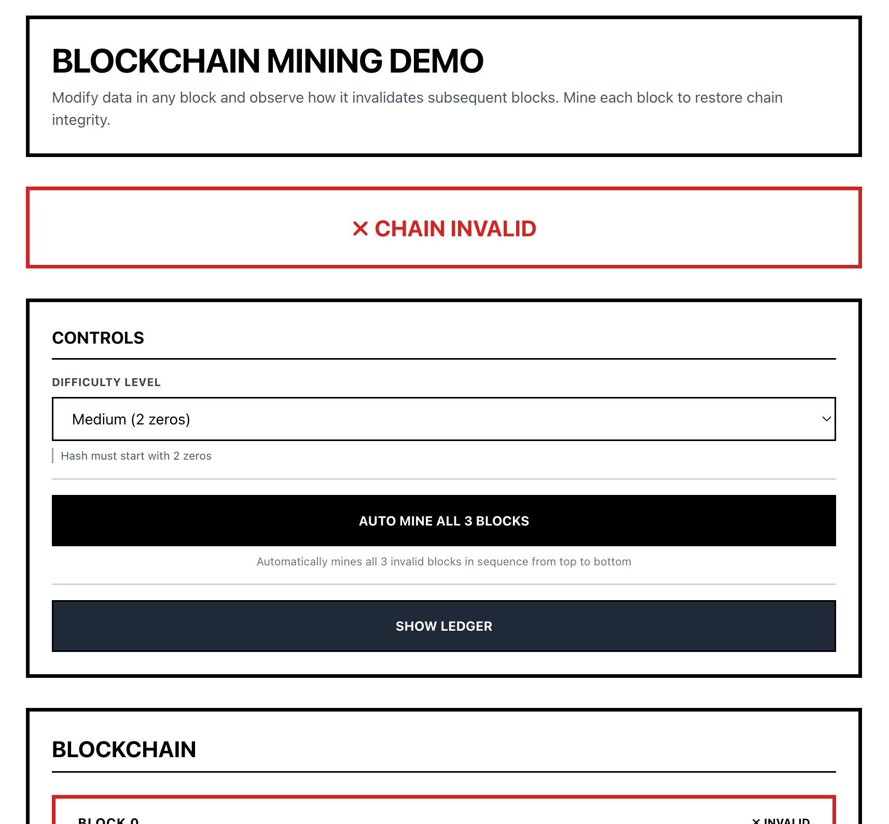
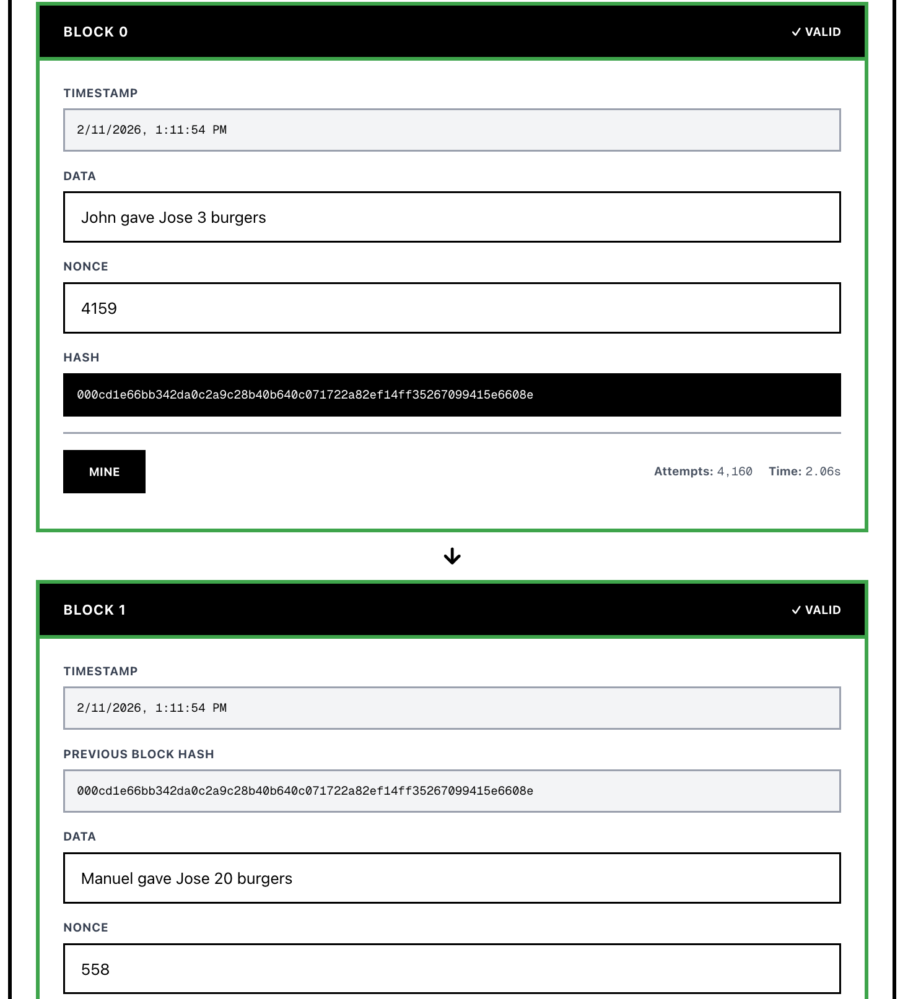

# Blockchain Mining Demo

## Screenshots


*Main blockchain interface showing 3 blocks with validation*


*Mining process with real-time feedback*

## About

An interactive blockchain visualizer built with Next.js that shows how blockchain mining and validation works. Features a real-time mining simulation using SHA-256 hashing.

**Key Features:**
- 3-block blockchain with visual validation (green = valid, red = invalid)
- Interactive mining with adjustable difficulty (1-4 leading zeros)
- Real-time hash computation and nonce discovery
- Chain integrity validation
- Transaction ledger view
- Tampering demonstration

## Tech Stack

- Next.js 16 + React 19
- TypeScript
- Tailwind CSS
- SHA-256

## How to Run

1. **Install dependencies:**
   ```bash
   npm install
   ```

2. **Start development server:**
   ```bash
   npm run dev
   ```

3. **Open browser:**
   Navigate to [http://localhost:3000](http://localhost:3000)

## Usage

1. Enter data in any block's input field
2. Click "Mine" to find a valid nonce
3. Modify existing block data to see chain invalidation
4. Use "Auto Mine All 3 Blocks" for sequential mining
5. Click "Show Ledger" to view all transactions

## Project Structure

```
src/
├── app/              # Next.js pages
├── components/       # React components
├── lib/              # Utility functions
└── utils/            # Blockchain logic
```

## Rubric Checklist

- ✅ **Chain display (20pts)** - All 6 fields: block number, timestamp, data, previous hash, nonce, hash
- ✅ **Mining functionality (20pts)** - Interactive mining with progress feedback (attempts, time)
- ✅ **Validation indicator (15pts)** - Green/red indicator, updates automatically
- ✅ **Difficulty selector (10pts)** - Dropdown with options 1-4 (leading zeros)
- ✅ **Clean UI (15pts)** - Minimalist brutalist design, clear visual feedback
- ✅ **Code quality (10pts)** - Modular components, TypeScript, clean architecture
- ✅ **README & screenshots (10pts)** - Complete instructions with 2 screenshots

**Total: 100/100 points**
